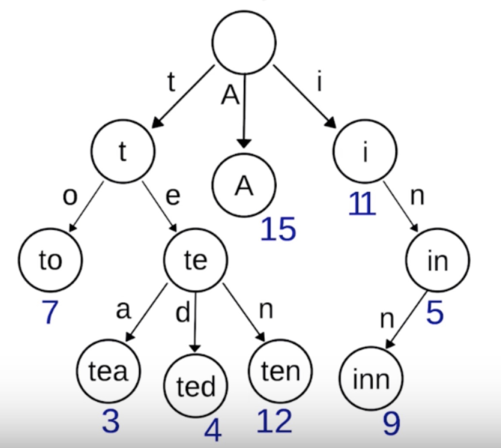

# 字典树(Trie)

解决问题，类似google搜索提示，即搜索引擎用于搜索词频统计。

**Trie结构**

是一种属性结构，哈希树的变种。



**Trie核心思想**

核心思想是空间换时间，利用字符串的公共前缀来减少查询时间以提高查询效率。
*字典树代码结构*
```
class TrieNode:
  def __init__(self):
    self.children = [None] * ALPHABET_SIZE
    self.isEndOfWord = NO
```

**Trie性质**

- 根节点不包含字符，每个根节点只包含一个，或者不包含
- 从根节点到某一节点，路径上经过的节点连起来为该节点对应的字符串
- 每个节点的子节点包含的字符都不一样

## Leetcode真题

**208-实现 Trie (前缀树)-Medium**

> 明确题目

实现一个 Trie (前缀树)，包含 insert, search, 和 startsWith 这三个操作。


> 所有可能解法

- 字典树实现，使用数组或者字典存放节点的所有子节点。

> CODINNG

```
public class TrieNode {
    var isEnd:Bool
    var children:[Character:TrieNode]
    public init () {
        isEnd = false
        children = [Character:TrieNode]()
    }

    func containKey(_ key: Character) -> Bool {
        if children[key] == nil {
            return false
        } else {
            return true
        }
    }
    func getTrieNode(_ key: Character) -> TrieNode? {
        return children[key];
    }

    func setTrieNode(_ key: Character, trieNode: TrieNode) -> Void {
        children[key] = trieNode
    }

    func end() -> Bool {
        return isEnd
    }

    func setEnd() -> Void {
        isEnd = true
    }
}

class Trie {

    var root: TrieNode = TrieNode()

    /** Initialize your data structure here. */
    init() {
    }

    /** Inserts a word into the trie. */
    func insert(_ word: String) {
        var node = root
        for c in word {
            if !node.containKey(c) {
                node.setTrieNode(c, trieNode: TrieNode())
            }
            node = node.getTrieNode(c)!
        }

        node.setEnd()
    }

    /** Returns if the word is in the trie. */
    func search(_ word: String) -> Bool {

        let node = searchPrefix(word)
        if let safeNode = node, safeNode.end() {
            return true
        } else {
            return false
        }
    }

    func searchPrefix(_ word: String) -> TrieNode? {
        var node: TrieNode = root
        for c in word {
            if node.containKey(c) {
                node = node.getTrieNode(c)!
            } else {
                return nil
            }
        }

        return node
    }
    /** Returns if there is any word in the trie that starts with the given prefix. */
    func startsWith(_ prefix: String) -> Bool {
        let node = searchPrefix(prefix)
        if node != nil {
            return true
        } else {
            return false
        }
    }
}

/**
 * Your Trie object will be instantiated and called as such:
 * let obj = Trie()
 * obj.insert(word)
 * let ret_2: Bool = obj.search(word)
 * let ret_3: Bool = obj.startsWith(prefix)
 */
```
> TESTING：leetcode
